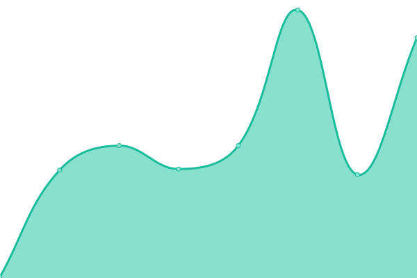
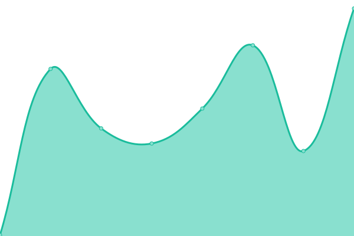
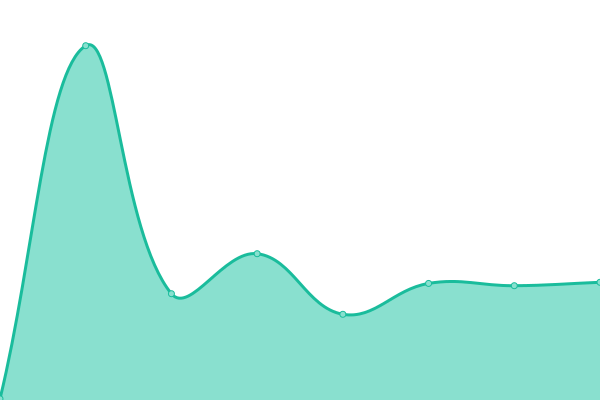
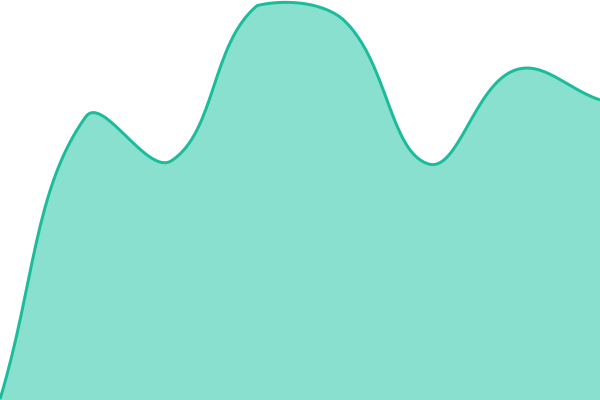

# [📈 Live Status](https://status.qarote.io): <!--live status--> **🟩 All systems operational**

This repository contains the open-source uptime monitor and status page for [Qarote](https://qarote.io), powered by [Upptime](https://github.com/upptime/upptime).

With [Upptime](https://upptime.js.org), you can get your own unlimited and free uptime monitor and status page, powered entirely by a GitHub repository. We use [Issues](https://github.com/getqarote/status/issues) as incident reports, [Actions](https://github.com/getqarote/status/actions) as uptime monitors, and [Pages](https://status.qarote.io) for the status page.

<!--start: status pages-->
<!-- This summary is generated by Upptime (https://github.com/upptime/upptime) -->
<!-- Do not edit this manually, your changes will be overwritten -->
<!-- prettier-ignore -->
| URL | Status | History | Response Time | Uptime |
| --- | ------ | ------- | ------------- | ------ |
|  [Website](https://qarote.io) | 🟩 Up | [website.yml](https://github.com/getqarote/status/commits/HEAD/history/website.yml) | 

 190ms
     
 | 

<a href="https://status.qarote.io/history/website">100.00%</a>
    

|  [App](https://app.qarote.io) | 🟩 Up | [app.yml](https://github.com/getqarote/status/commits/HEAD/history/app.yml) | 

 178ms
     
 | 

<a href="https://status.qarote.io/history/app">100.00%</a>
    

|  [API](https://api.qarote.io/livez) | 🟩 Up | [api.yml](https://github.com/getqarote/status/commits/HEAD/history/api.yml) | 

 462ms
     
 | 

<a href="https://status.qarote.io/history/api">100.00%</a>
    

|  [Portal](https://portal.qarote.io) | 🟩 Up | [portal.yml](https://github.com/getqarote/status/commits/HEAD/history/portal.yml) | 

 169ms
     
 | 

<a href="https://status.qarote.io/history/portal">100.00%</a>
    

|  [Demo](https://demo.qarote.io) | 🟩 Up | [demo.yml](https://github.com/getqarote/status/commits/HEAD/history/demo.yml) | 

 413ms
     
 | 

<a href="https://status.qarote.io/history/demo">100.00%</a>
    

<!--end: status pages-->

[**Visit our status website →**](https://status.qarote.io)

## 📄 License

- Powered by: [Upptime](https://github.com/upptime/upptime)
- Code: [MIT](./LICENSE) © [Anand Chowdhary](https://anandchowdhary.com), supported by [Pabio](https://pabio.com)
- Data in the `./history` directory: [Open Database License](https://opendatacommons.org/licenses/odbl/1-0/)
